

  

<h1 align="center">Intune / Autopilot / Endpoint Compliance Lab</h1>

  Windows 11 endpoint management lab using Microsoft Intune, Microsoft Entra ID, compliance policies, device configuration, app deployment, Defender, and Conditional Access.

## Overview

This project demonstrates a Microsoft Intune endpoint management lab using a Windows 11 Pro virtual machine enrolled into Microsoft Entra ID and managed through Microsoft Intune.

The lab covers Windows endpoint enrolment, compliance policies, device configuration, app deployment, Microsoft Defender security configuration, and Conditional Access using device compliance.

## Lab Environment

| Component               | Details                           |
| ----------------------- | --------------------------------- |
| Endpoint                | Windows 11 Pro 23H2               |
| Platform                | VMware Fusion Pro virtual machine |
| Device name             | WIN-INTUNE-01                     |
| Identity                | Microsoft Entra joined            |
| Management              | Microsoft Intune                  |
| Ownership               | Corporate                         |
| Conditional Access mode | Report-only                       |
| Test user               | Dedicated lab user                |

## Technologies Used

- Microsoft Intune
- Microsoft Entra ID
- Windows 11 Pro
- VMware Fusion Pro
- Microsoft Defender Antivirus
- Microsoft Store app deployment
- Company Portal
- Conditional Access
- Device compliance policies
- Settings catalog configuration profiles

## Architecture

| Layer              | Role                                                             |
| ------------------ | ---------------------------------------------------------------- |
| Windows 11 VM      | Managed endpoint                                                 |
| Microsoft Entra ID | Device identity and user authentication                          |
| Microsoft Intune   | Device management, compliance, configuration, and app deployment |
| Defender Antivirus | Endpoint protection baseline                                     |
| Conditional Access | Access control based on device compliance                        |
| Company Portal     | User-facing Intune app/device status portal                      |

## Project Goals

- Enrol a Windows 11 endpoint into Microsoft Intune
- Join the device to Microsoft Entra ID
- Create and apply a Windows compliance policy
- Troubleshoot compliance failures
- Create and deploy a device configuration profile
- Deploy Company Portal as a required app
- Configure Microsoft Defender Antivirus baseline settings
- Test Conditional Access using compliant-device requirements
- Document results with screenshots and evidence

---

# 1. Device Enrolment

The Windows 11 Pro VM was joined to Microsoft Entra ID and enrolled into Microsoft Intune.

## Result

| Check                    | Status |
| ------------------------ | ------ |
| Device visible in Intune | Passed |
| Managed by Intune        | Passed |
| Corporate ownership      | Passed |
| Compliance state visible | Passed |

## Evidence

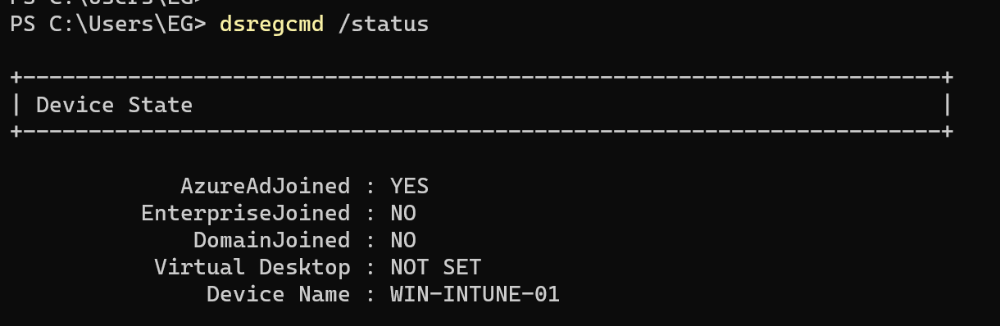

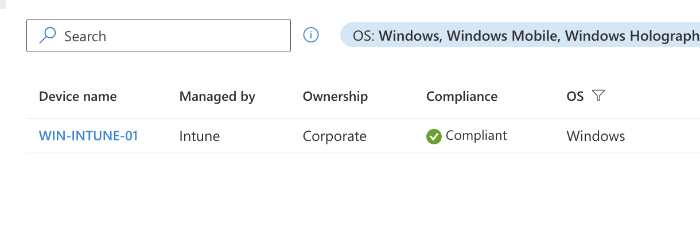

---

# 2. Compliance Policy

A Windows 10/11 compliance policy was created and assigned to the device.

## Policy Name

WIN11-LAB-Compliance-Baseline

## Compliance Settings

| Setting                        | Final Configuration |
| ------------------------------ | ------------------- |
| Minimum OS version             | 10.0.22631.0        |
| Trusted Platform Module        | Required            |
| Microsoft Defender Antimalware | Required            |
| Real-time protection           | Required            |
| Secure Boot                    | Not configured      |

## Troubleshooting Note

The original policy required Secure Boot. The VMware Fusion Windows 11 VM reported Secure Boot as non-compliant, even though the device was otherwise healthy and Intune-managed.

To keep the lab VM-safe, Secure Boot was removed from the compliance requirement while TPM, Defender, real-time protection, and minimum OS version checks remained enabled.

## Result

| Policy                        | Status    |
| ----------------------------- | --------- |
| WIN11-LAB-Compliance-Baseline | Compliant |

## Evidence

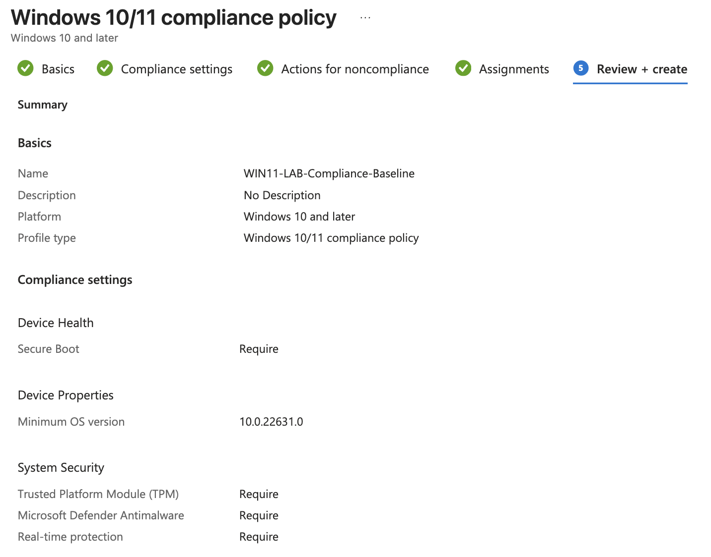

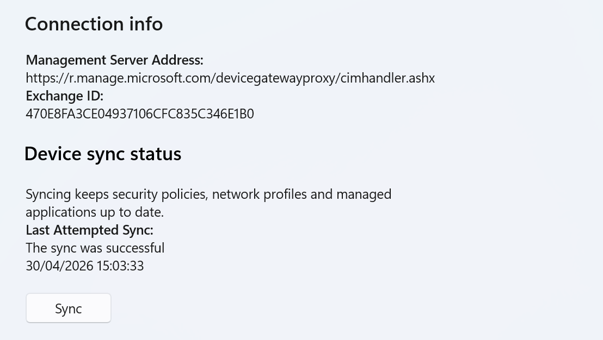

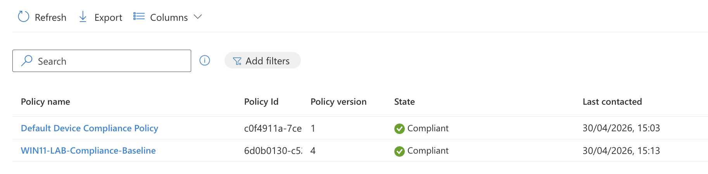

---

# 3. Device Configuration Profile

A Settings Catalog configuration profile was created and deployed to enforce baseline endpoint settings.

## Profile Name

WIN11-LAB-Device-Configuration-Baseline

## Configuration Areas

| Area                            | Purpose                                    |
| ------------------------------- | ------------------------------------------ |
| Device Lock                     | Configure password and inactivity settings |
| Local Policies Security Options | Configure inactivity lock behaviour        |
| Assignment                      | Applied to managed Windows device          |

## Result

| Profile                                 | Status    |
| --------------------------------------- | --------- |
| WIN11-LAB-Device-Configuration-Baseline | Succeeded |

## Evidence

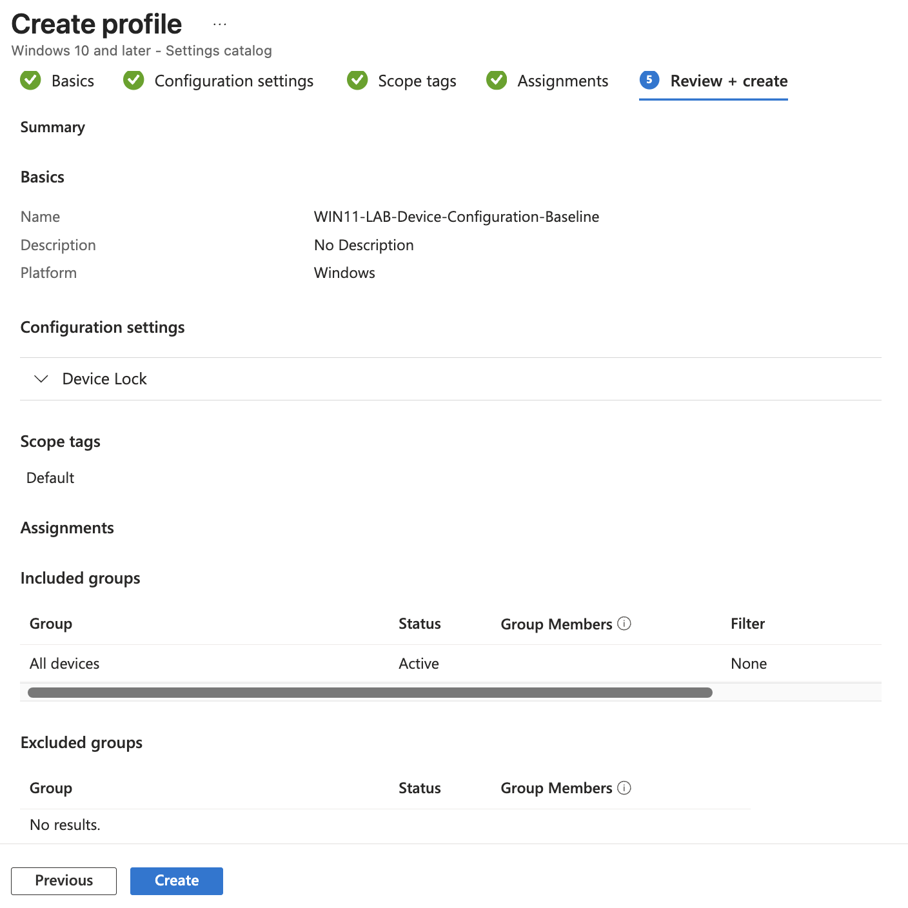

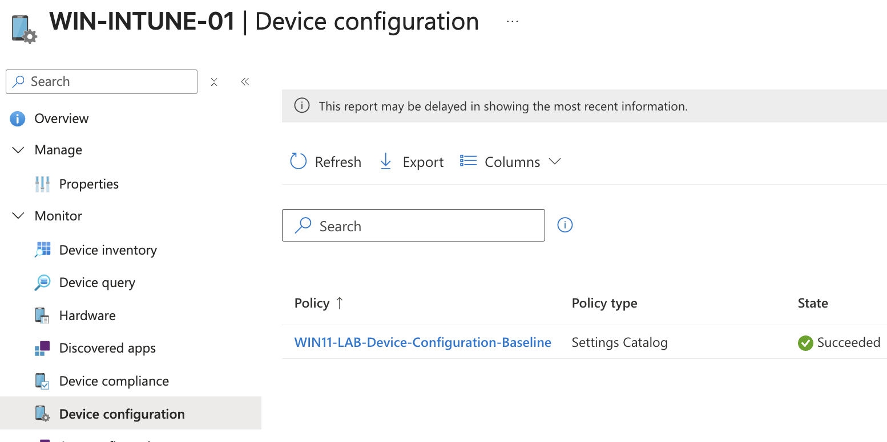

---

# 4. App Deployment

Company Portal was deployed as a required Microsoft Store app through Intune.

## App

| App            | Deployment Type         | Assignment       |
| -------------- | ----------------------- | ---------------- |
| Company Portal | Microsoft Store app new | Required install |

## Result

| App            | Status    |
| -------------- | --------- |
| Company Portal | Installed |

## Evidence

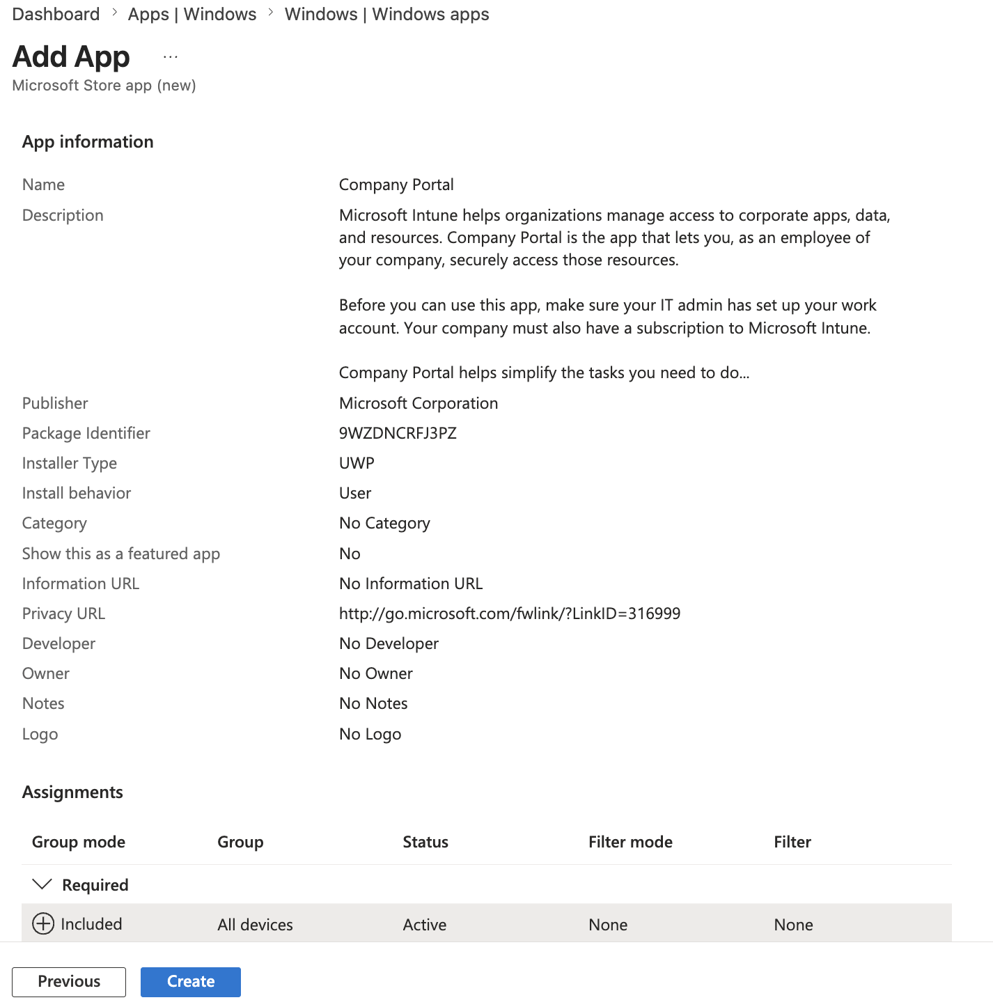

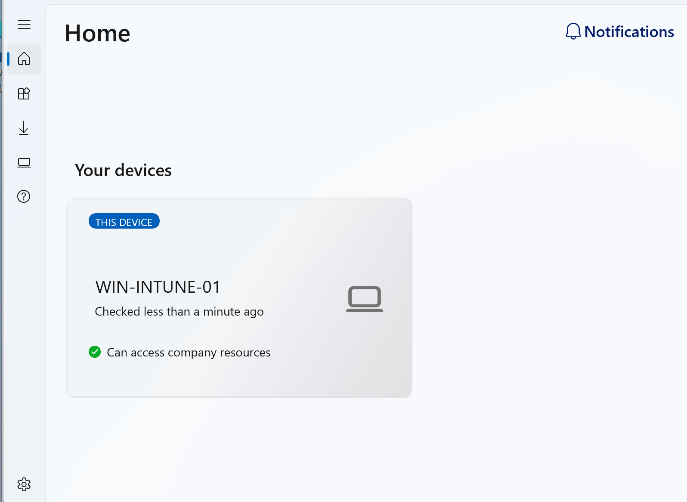

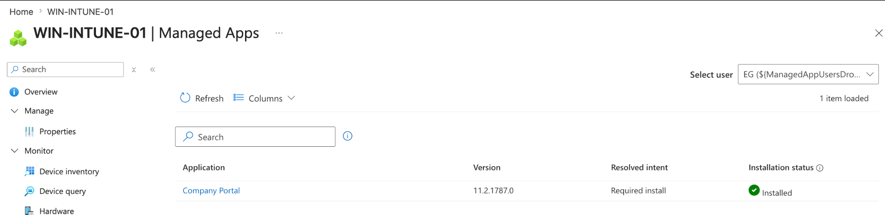

---

# 5. Microsoft Defender Antivirus Baseline

A Microsoft Defender Antivirus policy was created through Intune Endpoint Security.

## Policy Name

WIN11-LAB-Defender-Baseline

## Defender Settings

| Setting                  | Configuration |
| ------------------------ | ------------- |
| Real-time monitoring     | Enabled       |
| Cloud protection         | Enabled       |
| Behaviour monitoring     | Enabled       |
| PUA protection           | Enabled       |
| Removable drive scanning | Enabled       |

## Local Verification

PowerShell confirmed Defender was enabled and healthy on the Windows endpoint.

| Check                       | Result |
| --------------------------- | ------ |
| AMServiceEnabled            | True   |
| AntivirusEnabled            | True   |
| AntispywareEnabled          | True   |
| RealTimeProtectionEnabled   | True   |
| BehaviorMonitorEnabled      | True   |
| DefenderSignaturesOutOfDate | False  |

## Result

| Policy                      | Status  |
| --------------------------- | ------- |
| WIN11-LAB-Defender-Baseline | Success |

## Evidence

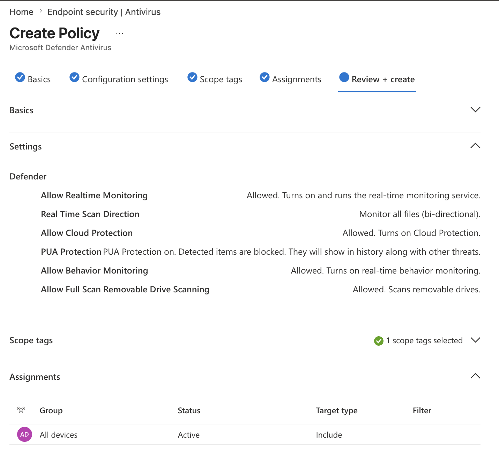

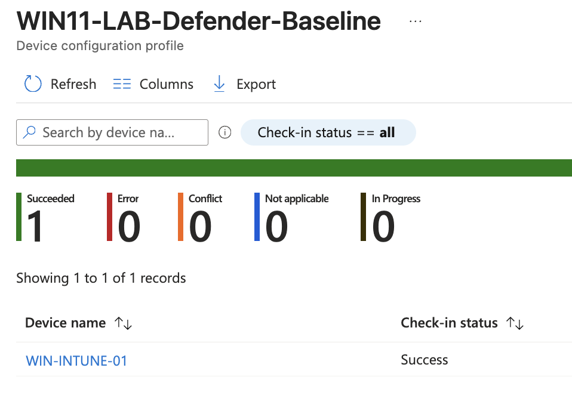

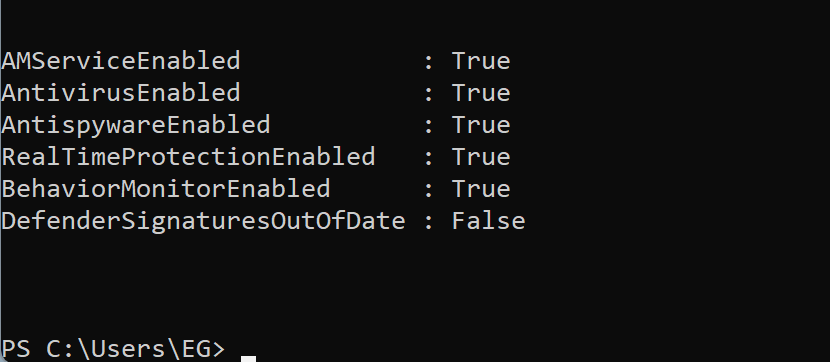

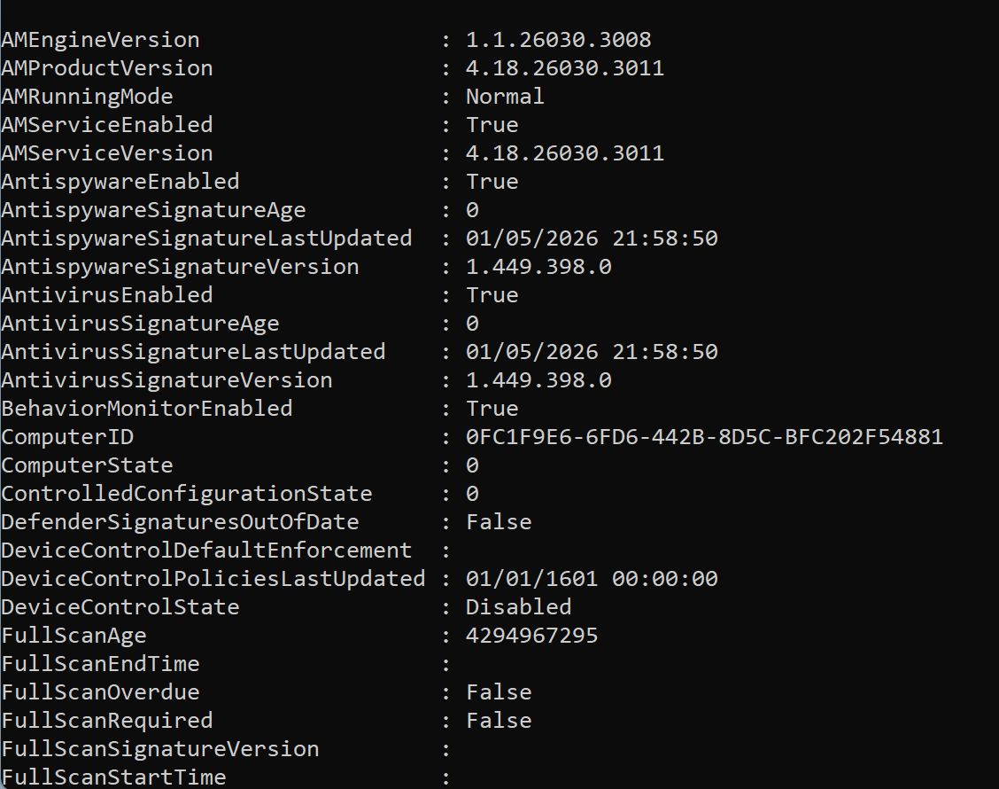

---

# 6. BitLocker VM Limitation

BitLocker was reviewed as part of the endpoint security baseline.

Because this lab uses a VMware Fusion Windows 11 ARM virtual machine, BitLocker enforcement was not used as a hard requirement. Hardware-backed encryption, Secure Boot, and disk encryption behaviour can differ between physical endpoints and virtual machines.

For a physical Windows 11 endpoint, BitLocker enforcement would normally be configured through:

Endpoint security > Disk encryption

This was documented as a VM limitation rather than forced in the lab.

---

# 7. Conditional Access

A Conditional Access policy was created to require a compliant device for cloud app access.

## Policy Name

CA-LAB-Require-Compliant-Device

## Policy Configuration

| Area             | Configuration                            |
| ---------------- | ---------------------------------------- |
| Users            | Specific lab user                        |
| Target resources | All cloud apps                           |
| Device platform  | Windows                                  |
| Grant control    | Require device to be marked as compliant |
| Policy mode      | Report-only                              |

## Test Result

Conditional Access successfully evaluated the Windows 11 endpoint as managed and compliant.

| Check                    | Result                 |
| ------------------------ | ---------------------- |
| Device detected          | Passed                 |
| Managed device           | Yes                    |
| Compliant device         | Yes                    |
| Join type                | Microsoft Entra joined |
| Grant control            | Satisfied              |
| Require compliant device | Satisfied              |

## Evidence

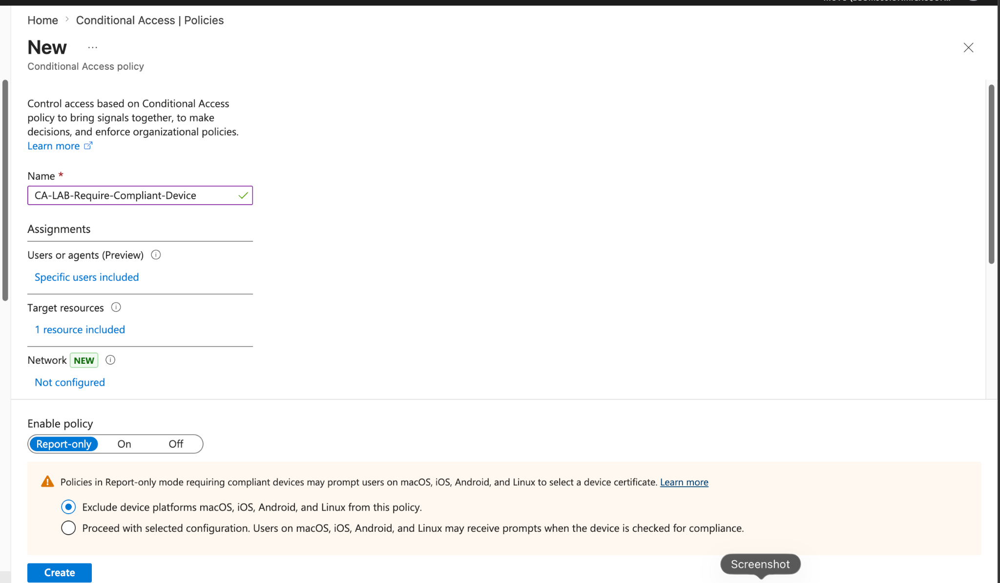

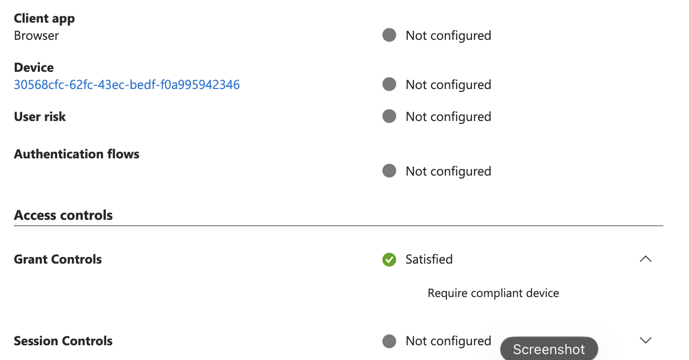

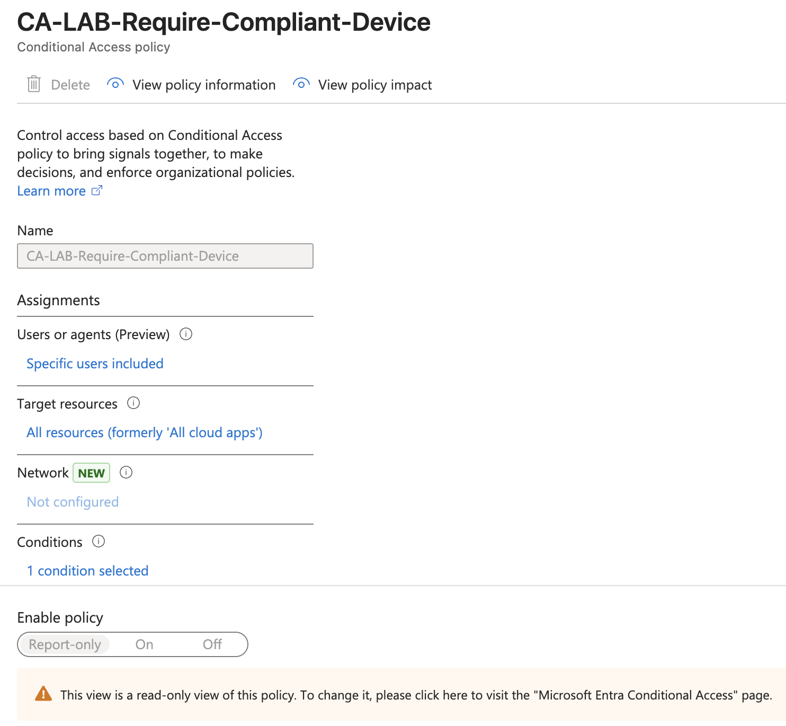

---

# Final Results

| Phase                        | Status     |
| ---------------------------- | ---------- |
| Windows 11 VM setup          | Complete   |
| Microsoft Entra join         | Complete   |
| Intune enrolment             | Complete   |
| Compliance policy            | Complete   |
| Device configuration profile | Complete   |
| App deployment               | Complete   |
| Defender baseline            | Complete   |
| BitLocker review             | Documented |
| Conditional Access test      | Complete   |

## Key Skills Demonstrated

- Windows endpoint enrolment into Microsoft Intune
- Microsoft Entra joined device management
- Compliance policy creation and troubleshooting
- Intune Settings Catalog profile deployment
- Required app deployment through Intune
- Microsoft Defender Antivirus baseline configuration
- Conditional Access policy design
- Compliant-device access control testing
- VM-specific endpoint troubleshooting
- Evidence-based technical documentation

## Troubleshooting Highlights

| Issue                            | Resolution                                             |
| -------------------------------- | ------------------------------------------------------ |
| UTM display issues               | Switched to VMware Fusion Pro                          |
| Windows setup network/OOBE issue | Used local setup path, then joined Entra after install |
| Secure Boot compliance failure   | Removed Secure Boot requirement due to VM limitation   |
| Company Portal install delay     | Restored Microsoft Store and forced Intune sync        |
| Conditional Access not applying  | Used normal Edge session with device identity present  |
| CA device unknown                | Confirmed device token/device identity and retested    |

## Repository Structure

| Path                                 | Purpose                           |
| ------------------------------------ | --------------------------------- |
| docs/                                | Lab notes and documentation       |
| policies/compliance/                 | Compliance policy notes           |
| policies/configuration/              | Configuration and BitLocker notes |
| policies/conditional-access/         | Conditional Access notes          |
| screenshots/01-device-enrolment/     | Device enrolment evidence         |
| screenshots/02-compliance-policy/    | Compliance policy evidence        |
| screenshots/03-device-configuration/ | Device configuration evidence     |
| screenshots/04-app-deployment/       | App deployment evidence           |
| screenshots/05-conditional-access/   | Conditional Access evidence       |
| screenshots/06-defender-bitlocker/   | Defender and BitLocker evidence   |

## Security Notes

Sensitive values such as tenant IDs, device IDs, user identifiers, and email addresses should be redacted before publishing screenshots publicly.

## Summary

This lab demonstrates a full Microsoft endpoint management workflow using Microsoft Intune, Microsoft Entra ID, Windows 11, Defender, app deployment, and Conditional Access.

The final endpoint was successfully enrolled, managed, configured, secured, marked compliant, and evaluated by Conditional Access as satisfying the compliant-device requirement.
